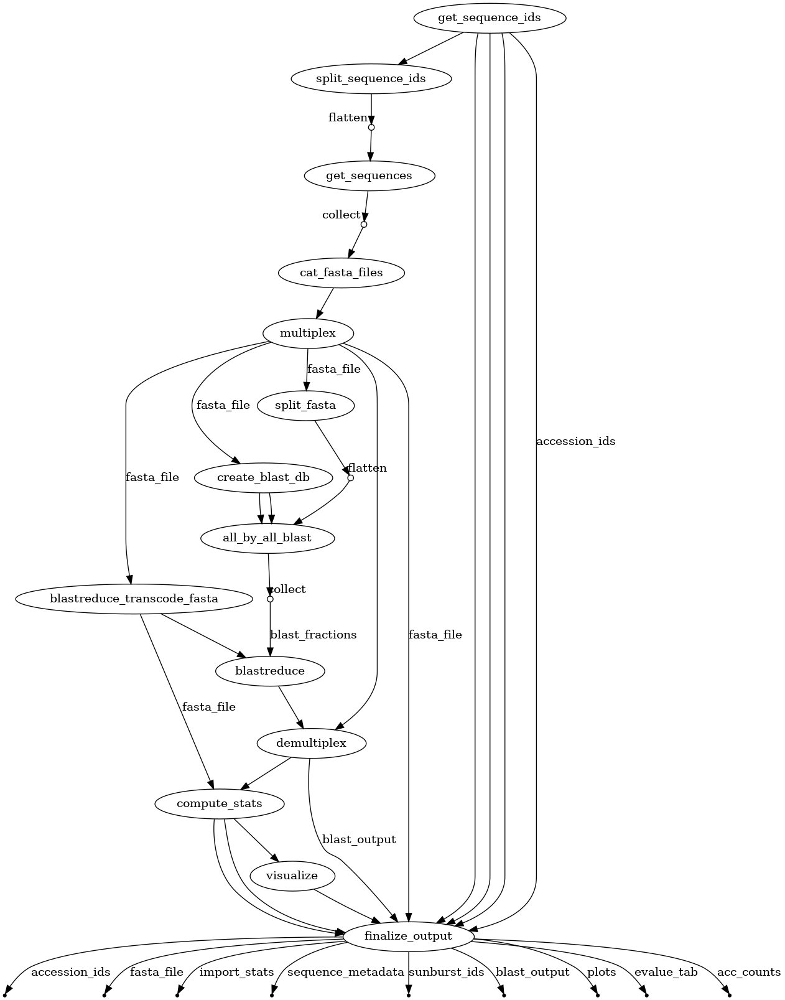

# Enzyme Function Initiative - Enzyme Similarity Tool
EFI-EST is a flexible pipeline which builds Sequence Similarity Networks of
proteins for the purpose of elucidating the function of enzymes. It is available
through a web tool at https://efi.igb.illinois.edu/efi-est/ and on [KBase]().
This respository contains the analysis code that these services use.


# Running the Pipeline
## Prerequisites
The pipeline is developed with
[Nextflow](https://www.nextflow.io/docs/latest/index.html) and uses python
3.10.12. It also relies upon [DuckDB](https://duckdb.org/) and [BLAST
2.2.26](https://ftp.ncbi.nlm.nih.gov/blast/executables/legacy.NOTSUPPORTED/2.2.26/).
All of these dependencies are available through the [efi/efi-est]() docker
container. If running without docker, they will need to be installed manually
along with the python packages in `requirements.txt`.

## Running locally via docker
### EST
1. Download the `efi/efi-est:latest` docker image:
   ```
   docker pull efi/efi-est:latest
   ```
2. A `params.yml` file must be created to control the behavior of the pipeline.
   This repository provide a simple script which will populate the requisite
   fields, but the file may also be created by hand. To use the provided script:
   ```
   python create_est_nextflow_params.py --fasta-file <path_to_fasta> --output-dir <path_to_results_dir>
   ```
   (This script has no dependencies outside the python standard library so your
   system version of python should work fine. If not, simply copy
   [templates/params-template.yml](templates/params-template.yml) and fill out
   manually.)

3. The pipeline may now be executed. The script in step 2 writes a `params.yml`
   file to the specified output directory, this file must be referenced in this
   run command.
   ```
   nextflow -C conf/docker.config run est.ng -params-file <path_to_results_dir>/params.yml
   ```

4. After the pipeline completes, output files will be available in the results directory
   ```
   $ ls <path_to_results_dir>
   1.out.parquet    edge.png     evalue.tab  length_sm.png  pident.png
   acc_counts.json  edge_sm.png  length.png  params.yml     pident_sm.png
   ```
   `pident.png` and `length.png` can be used to determine the appropriate
   alignment score cutoff for the SSN creation.

### SSN
The EST pipeline described above creates edges between sequences with high
similarity. In this second step, edges with low alignment scores are filtered
out and the network is rendered in a format which can be read by
[Cytoscape](https://cytoscape.org/). Only run these steps after the EST pipeline
has successfully completed.

coming soon

## Running on a compute cluster
Nextflow can easily adapt to the available computing resources by using a
different configuration file. This example will assume a cluster that uses Slurm
for scheduling, but may be adapted for other systems. You must have Nextflow,
DuckDB, Python, and Perl installed on your cluster.

### EST
1. Nextflow will be executed in a batch job which will launch other batch jobs
   as needed. To generate the script which starts the pipeline, use the provided
   generation script:
   ```
   python create_est_nextflow_job.py --config-path conf/slurm.config --fasta-file <path_to_fasta>  --output-dir <path_to_results_dir>
   ```
   This will create two files in `<path_to_results_dir>`, `run_nextflow.sh` and
   `params.yml`.

2. To run the pipeline, submit the job script to the scheduler
   ```
   sbatch <path_to_results_dir>/run_nextflow.sh
   ```
   Files created by the pipeline as well as logs of stdin and stderr will be in
   `<path_to_results_dir>`.

3. After the pipeline completes, output files will be available in the results directory
   ```
   $ ls <path_to_results_dir>
   1.out.parquet    edge.png     evalue.tab  length_sm.png  pident.png
   acc_counts.json  edge_sm.png  length.png  params.yml     pident_sm.png
   ```
   `pident.png` and `length.png` can be used to determine the apropriate
   alignment score cutoff for the SSN creation.

### SSN
Coming soon

## Troubleshooting
### My pipeline crashes because a process was killed
If the process is `all_by_all_blast`, `blast_reduce`, or `compute_stats`, then
this is likely because DuckDB tried to allocate too much memory. You can try
decreasing the number of DuckDB threads with the `--duckdb-threads` option on
the template rendering scripts or increasing the soft-limit on memory usage with
`--duckdb-memory-limit`. DuckDB generally does a good job of swapping results to
disk if it is memory constrained but some operations require some minimum amount
of memory. If these solutions did not solve the problem, try using the newest
version of DuckDB (which may require manually building the docker image) or
decreasing the number of `--blast-matches` which will reduce the total number of
edges processed.

## Execution Details


The EST pipeline consists of different stages which transform the input sequences into network edges. The stages are executed roughly in this chronological order
1. **Import Sequences**. A FASTA file copied into the workflow. In the future,
   sequence input will be more flexible and will allow for accession IDs,
   sequences found by BLAST, family IDs, and more.

2. **Create BLAST Database and split FASTA**. From the FASTA file, a BLAST
   database is created. The FASTA file is also split into several smaller files.
   EFI-EST uses a non-parallelized version of BLAST; splitting the input file
   allows for running multiple searches simultaneously.

3. **All-by-all BLAST**. Every sequence in the FASTA file is used as a query
   against the BLAST database. Shards of the FASTA from the previous step can be
   run in parallel. The result of this process is a multiset of edges between
   sequences. In this stage, the BLAST tabular output is converted to
   [Parquet]() files for more efficient processing. The conversion is referred
   to as "transcoding" in the code. The is the most computationally intensive
   stage of the pipeline.

4. **BLASTreduce**. All-by-all BLAST creates a multiset of directed edges, but a
   set without duplicity is needed to generate the network. This stage selects
   the edges that best represent the similarity between two sequences. This
   stage may be computationally intensive if the number of edges is high.

5. **Compute Statistics**. One of the primary outputs of the EST pipeline is a
   set of plots which show the distribution of percent identity and sequence
   length as a function of alignment score. In this stage, five-number summaries
   of percent identity and alignment length at each alignment score are
   calculated, along with a cumulative sum of alignment score counts and a
   convergence ratio metric.

6. **Visualization**. In this stage, the five-number summaries are rendered into
   plots. A histogram of edge lengths is also produced.

7. **Output**. This stage copies all of the pertinent files generated by the
   pipeline to the user-specified output directory. In the future it may
   generate an HTML report or compressed archive.

## Citing
Please cite your use of EFI-EST.

>Rémi Zallot, Nils Oberg, and John A. Gerlt, *The EFI Web Resource for Genomic
Enzymology Tools: Leveraging Protein, Genome, and Metagenome Databases to
Discover Novel Enzymes and Metabolic Pathways.* Biochemistry 2019 58 (41),
4169-4182. https://doi.org/10.1021/acs.biochem.9b00735

>Nils Oberg, Rémi Zallot, and John A. Gerlt, *EFI-EST, EFI-GNT, and EFI-CGFP:
Enzyme Function Initiative (EFI) Web Resource for Genomic Enzymology Tools.* J
Mol Biol 2023. https://doi.org/10.1016/j.jmb.2023.168018

## Papers
1. Nils Oberg, Rémi Zallot, and John A. Gerlt, *EFI-EST, EFI-GNT, and EFI-CGFP:
   Enzyme Function Initiative (EFI) Web Resource for Genomic Enzymology Tools.* J
   Mol Biol 2023. https://doi.org/10.1016/j.jmb.2023.168018

2. Rémi Zallot, Nils Oberg, and John A. Gerlt, *The EFI Web Resource for Genomic
   Enzymology Tools: Leveraging Protein, Genome, and Metagenome Databases to
   Discover Novel Enzymes and Metabolic Pathways.* Biochemistry 2019 58 (41),
   4169-4182. https://doi.org/10.1021/acs.biochem.9b00735

3. Rémi Zallot, Nils Oberg, John A. Gerlt, *"Democratized" genomic enzymology web
   tools for functional assignment, Current Opinion in Chemical Biology*, Volume
   47, 2018, Pages 77-85, https://doi.org/10.1016/j.cbpa.2018.09.009

4. John A. Gerlt, *Genomic enzymology: Web tools for leveraging protein family
   sequence–function space and genome context to discover novel functions*,
   Biochemistry. Volume 56, 2017, Pages 4293-4308.
   https://doi.org/10.1021/acs.biochem.7b00614

5. John A. Gerlt, Jason T. Bouvier, Daniel B. Davidson, Heidi J. Imker, Boris
   Sadkhin, David R. Slater, Katie L. Whalen, *Enzyme Function Initiative-Enzyme
   Similarity Tool (EFI-EST): A web tool for generating protein sequence
   similarity networks*, Biochimica et Biophysica Acta (BBA) - Proteins and
   Proteomics, Volume 1854, Issue 8, 2015, Pages 1019-1037, ISSN 1570-9639,
   https://dx.doi.org/10.1016/j.bbapap.2015.04.015
