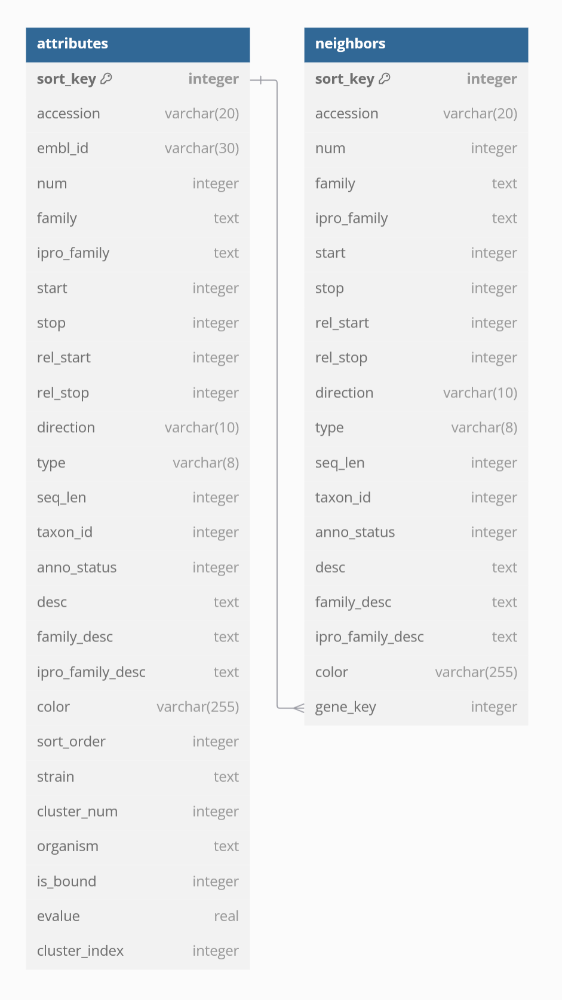

Genome Neighborhood Diagram Tool
================================

The genome neighborhood diagram tool creates databases for genome
neighborhood diagrams (GNDs).  The output database is in SQLite format
and is designed to be used in a web-based viewer app; while the database
is presented graphically, the tables in the database can be analyzed using
custom bioinformatics tools and scripts should the user so desire.

The pipeline uses an input file containing a list of IDs, and optionally
cluster numbers, and generates the GND database by retrieving the
genome context for the IDs.  If clusters are specified, then the IDs in
the database are retrieved in such a way that they can be displayed in
the web viewer grouped by cluster number.

Running the Pipeline
--------------------

Generating a Parameter File
~~~~~~~~~~~~~~~~~~~~~~~~~~~

The GND pipeline is configured through a YAML (or JSON) file containing
parameters. The parameter file may be created manually or by running
``bin/create_gnd_nextflow_params.py``. An example usage of the command: ::

   python bin/create_gnd_nextflow_params.py --output-dir results/ --cluster-id-map id_list.txt --efi-config efi.config --efi-db efi_db.sqlite

The pipeline loads sequence IDs from the input file (e.g. ``id_list.txt``)
and extracts genome context from the EFI database to create the GNDs.
The other parameters are required for saving the output and specifying the
data source that is used to retrieve genome context.

The pipeline may then be executed with the file generated by this command::
   
   nextflow run pipelines/gnd/gnd.nf -params-file results/params.yml

Generating a Job Script
~~~~~~~~~~~~~~~~~~~~~~~
To run in a cluster environment, use ``bin/create_nextflow_job.py`` to generate a
SLURM job script which runs the pipeline. The command would use the ``gnd``
subcommand: ::

   python bin/create_nextflow_job.py gnd --output-dir results --cluster-id-map id_list.txt --efi-config efi.config --efi-db efi_db.sqlite

This can then be submitted to the cluster with ::

   sbatch run_nextflow.sh

Database Schema
---------------

The database is composed of two primary tables containing information for
displaying the diagrams: the C<attributes> table with one row for every ID
in the input file, and the C<neighbors> table for the neighbors of each
ID.  The C<neighbors> table is linked to the C<attributes> table through
the C<gene_key> field which maps to the C<attributes>.C<sort_key> field.

See the Schema section in the
:doc:`GND module documentation </source/lib/EFI/GNT/GND.pm>`
for an explanation of the schema fields.

Further Reading
---------------

.. toctree::
   :maxdepth: 1

   create_gnd.rst
   ../gnt/create_gnns.rst
   /source/lib/EFI/GNT/GND.pm.rst

